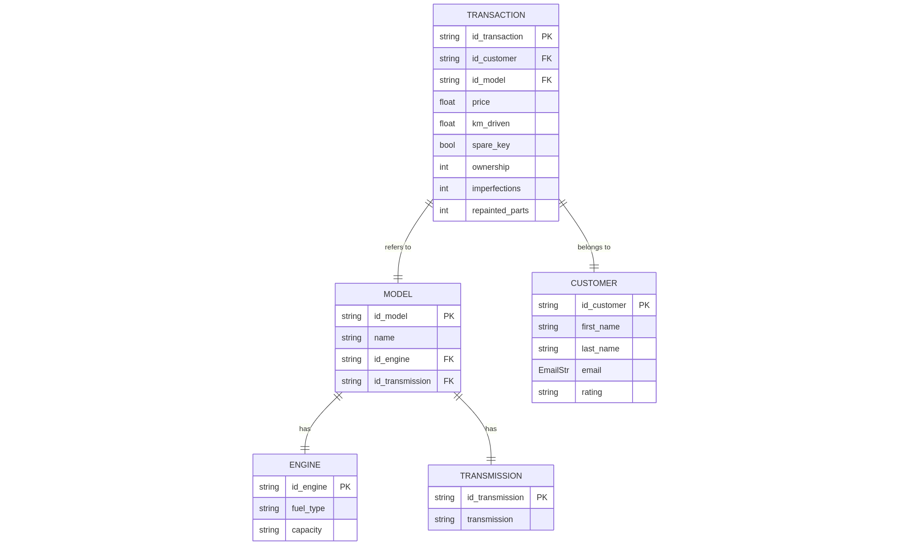

# Projet informatique Cars24

Le but du projet est de mettre en place une base de données MySQL et de l'exploiter de manière simple.

## Dataset

Le dataset utilisé représente une liste de motos, leurs prix et leurs caractéristiques techniques. Factuellement, ces données pourraient être issues d'un site d'annonce en ligne type "La Centrale".

Les données sont issues de Kaggle: https://www.kaggle.com/datasets/amanrajput16/used-car-price-data-from-cars24

## Diagramme Entité relation

La structure retenue pour la base est la suivante:



On décompose tout d'abord un modèle de moto en 2 parties distinctes:

- Un moteur
- Une transmission

Pour chaque annonce (transaction), on a un modèle de moto à un prix donné et dans un état donné.

La table customer (le terme vendeur serait plus approprié) est un ajout permettant d'ajouter une nouvelle table ainsi que de la complexité au problème.

## Stack Technique

La base de données MySQL est encapsulée dans une image docker. Pour son suivi (avec interface), on utilise PhPMyAdmin (autre image). Le tout est orchestré par docker compose.

La gestion en python passe par deux packages importants:

- `Pydantic` permettant la validation des schémas et l'integration plus aisée de nouvelles entrées à la base de donnée.
- `mysql.connector` permettant la connection avec le conteneur docker.

Le tout est stocké dans le fichier `db.py`.


## Mise en place

D'abord il est necessaire d'installer toute les dépendances. Pour cela, un fichier `requirements.txt` est mis à disposition. Il est également possible d'executer le code dans le notebook `notebooks/setup.ipynb`.

Ensuite, il y a deux possibilités:

**Base de données pleine**

Une extraction complète de la base de données crées est disponible dans `data/cars24.sql`. Pour directement l'utiliser, il suffit de s'assurer que le bon entrypoint est commenté dans le fichier `docker-compose.yml`.

Par exemple:

```bash
volumes:
      #- ./data/init.sql:/docker-entrypoint-initdb.d/init.sql
      - ./data/cars24.sql:/docker-entrypoint-initdb.d/init.sql
```

Une fois cette formalité réglée, il suffit de **up** les conteneurs:

```bash
docker compose up -d
```

**Base de données Vide**

Dans cette situation, commenter les valeurs comme cela:

```bash
volumes:
      - ./data/init.sql:/docker-entrypoint-initdb.d/init.sql
      #- ./data/cars24.sql:/docker-entrypoint-initdb.d/init.sql
```

On peut ensuite lancer les scripts dans `notebooks/feed_database.ipynb` pour l'alimenter.


## Exemple de requêtes SQL

Plusieurs exemples sont disponibles dans `notebooks/sql.ipynb`

```python
import sys

sys.path.append("../")
from db import Engine, Transaction, Transmission, Customer, Model, MySQLConnector

conn = MySQLConnector()
conn.connect()

conn.execute(
"""
SELECT model_name, price, km_driven, email, rating, fuel_type, capacity FROM transaction 
LEFT JOIN customer ON customer.id_customer = transaction.id_customer
LEFT JOIN model ON model.id_model = transaction.id_model
LEFT JOIN engine ON model.id_engine = engine.id_engine
WHERE model.id_transmission IN (
    SELECT id_transmission
    FROM transmission
    WHERE transmission_type = 'Manual'
)
LIMIT 10
"""
)
```

